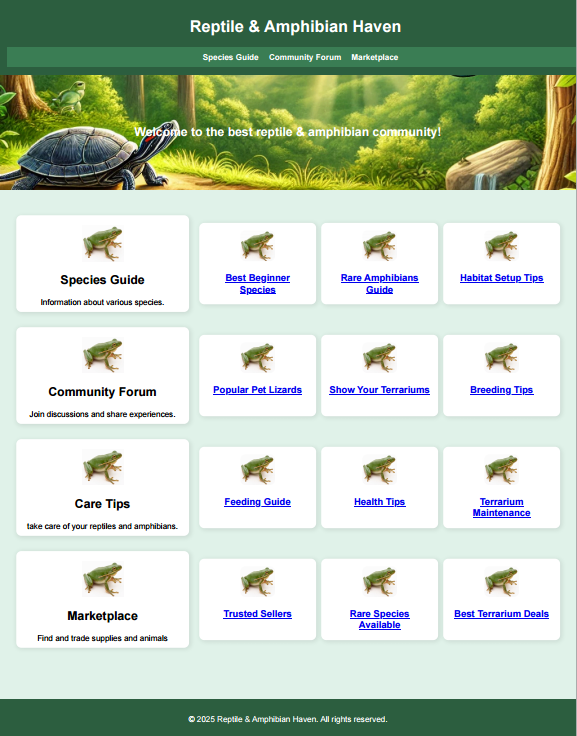
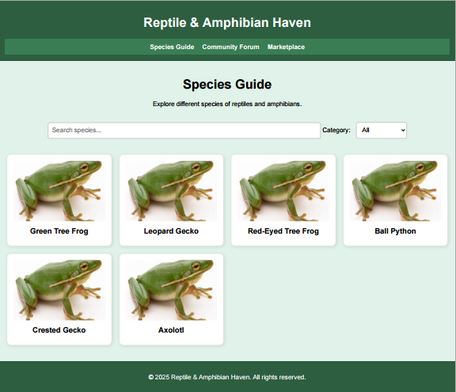
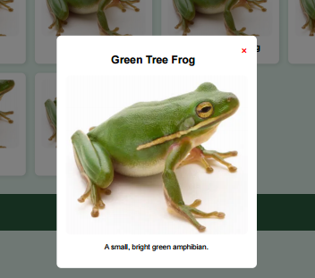
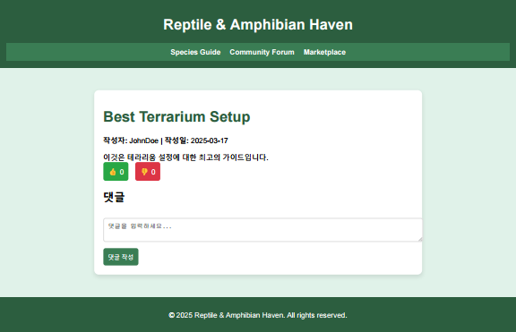
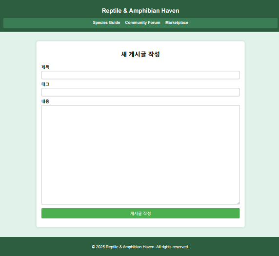

# Reptile Web FrontEnd
## Version 1.0
sprint date : 25.03.19 ~ 25.04.01

Developer : yeochi1201@gmail.com

### Main Page

#### Header
- Site Title
- Link
  - Species Guide -> species-page
  - Community Forum -> community-page
  - Marketplace -> marketPlace-page
#### Footer
- CopyRight

#### Content
- Daily Best Post * 3 for each Content
  - Species Guide
  - Community Forum
  - Care Tips
  - Marketplace
  
### Species Guid

#### Search
- Find by Name
- Find by Category
  - Reptile
  - Amphibian

#### Card
- Species Image
- Species Name
  
#### Modal

 - Species Name
 - Species Image
 - Species Description

### Community & Forum

#### Select
 - Forum Select
   - General => General Free Post
   - Care Tip => Care Tip Post
   - MarketPlace => Market Place Post

#### List
 - Post id
 - Post Title
 - Author
 - Tag
 - Write Date

#### Post

 - Post Title
 - Author
 - Write Date
 - Post Content
 - Good Button
 - Bad Button

#### Comment
 - Comment Content
 - Author
 - Write Date
 - Comment Good Button

#### Post Write

 - Title
 - Tag
 - Content